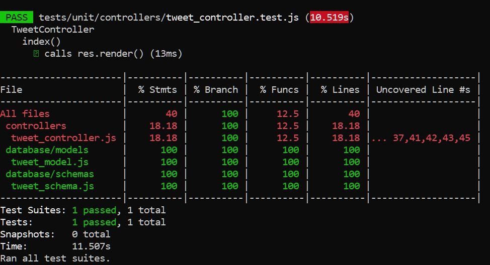
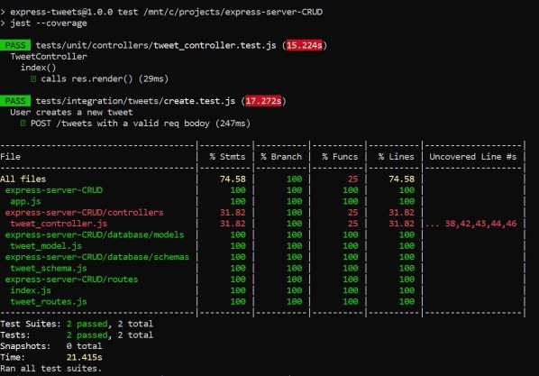
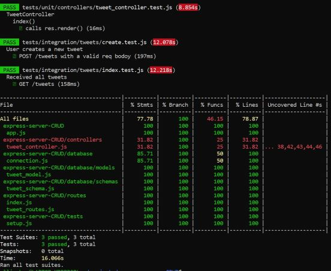

# Express Tweets

- Full CRUD resources (create, read, update and delete tweets and users).
- [Optional] HTML pages with express-handlebars.
- MongoDB database implementation.
- Dynamic Routing.
- Document database normalising (referencing)
- Document database denormalising (embedding).
- Jest unit testing.
- Jest/Supertest integration testing.

---

### 1209 Express MVC & MongoDB Morning Challenge: https://coderacademy.instructure.com/courses/239/pages/express-mvc-and-mongodb?module_item_id=9456

##### Core:
* ##### Create an Express web server that is able to handle a full CRUD (create, read, update, delete) resource named Tweet
* ##### Do not add any html, this will be an API that only responds back in JSON

##### Advanced:
* ##### Track this resource inside of a MongoDB database
---
### Core - Initial Setting

__1. Create a directory for this project (can be named anything)__
```
$ mkdir express-server-CRUD
```

- Use 'npm init' to create package.json file. 
- Use '-y' at the end of 'npm init' to save time from pressing enter.

```
$ npm init -y
```

__2. Install dependencies (production and development)__
- __Express__ - Node web server framework to make routing easier and adds a bunch more functionality.
- __Body-parser__ - Middleware used to change the data on the request from a steam into usable data available at response.body
- [Optional - not required for this challenge] __Express-handlebar__ - JavaScript templating engine for serving up our html web pages

```
$ npm install --save express body-parser express-handlebars
```
- You can install several dependencies at the same time.
- (After npm 5, you can skip '--save') Refer here for more details about the npm install commands: https://stackoverflow.com/questions/19578796/what-is-the-save-option-for-npm-install

__3. Install development dependencies__
- __Nodemon__ - Watches for changes in our JS file and auto restarts our server when it detects them. (Saves us from manually stopping and starting the server).
- __Forever__ - Makes sure that if the server crashes it will automatically restart.

```
$ npm install --save-dev nodemon forever
```

__4. [Important] Create a .gitignore file in root directory__
```
$ touch .gitignore
```
- Write 'node_modules' inside .gitignore, as we don't wanna push our node modules to GitHub 
```
node_modules
```

__5. Set up package.json__
- Create our own npm run script in package.json
- [Optional] Also remember to change your app entry point to 'app.js', as we are creating an 'app.js' file here. By default, the entry point is 'index.js'. You can keep the default name, but remember to name your file as 'index.js'.

```
touch app.js
```

```javascript

"main": "app.js",

 "scripts": {
    "server": "forever -c \"nodemon --exitcrash -L\" app.js"
  },
```

- After that, we can run our npm script with the following command
```
npm run server
```
---

### Core - Basic CRUD I (Create new Tweets & Read all tweets)

__1. Create basic commands and routes in 'app.js'__
__2. [Optional] Complete Views (layouts/tweets) with handlebars__
__3. Separate routes into 'routes.js'__
__4. Create Controller & move our business logic from routes.js to controllers\tweet_controller.js__

controllers\tweet_controller.js
```javascript
const tweets = []; 

function index(req, res){
    res.render("tweets/index", { tweets }); //{ tweets }: shorthand when an object's key is same as value
}

function create(req, res) {
    const { username, post } = req.body;
    const newTweet = { username, post };

    tweets.push(tweet);
    res.redirect("/tweets"); 
}

function newResource(req, res){
    res.render("tweets/form");
}

module.exports = {
    index,
    create,
    newResource
}
```
---
### Advanced - Implement MongoDB
- Mongoose: object data modelling tool

__1. Install Mongoose to connect our app to MongoDB__
```
npm install mongoose --save
```

__2. Add the following code into 'app.js'__
```javascript
const mongoose = require("mongoose");

mongoose.connect("mongodb://localhost/tweet_app", { useNewUrlParser: true });
mongoose.Promise = global.Promise;
mongoose.connection.on("error", (error)=> {console.log(error)});
```

__3. Start MongoDB__
- Stop your express server
- Run 'mongod' in a terminal window
- Restart your express server ('npm run dev') in another terminal window

__4. Create Database & Schema__
- Create a directory called 'database'
- Inside 'database', create a directory called 'schemas'
- Inside 'schemas', create a file called 'tweet_schema.js'

database\schemas\tweet_schema.js
```javascript
const mongoose = require("mongoose");
const Schema = mongoose.Schema; //'Schema' is capitalised here as it returns a 'class'

const TweetSchema = new Schema({
    //username: String    shorthand: but we don't use it as we prob need more properties 
    username: {           //longhand
        type: String,
        required: true
    },
    post: {
        type: String,
        required: true
    }
});

module.exports = TweetSchema; //schema is not a model: we turn some schemas into models
```

__5. [G's convention] Create Model in a separate directory__
- Inside 'database', create a directory called 'models'
- Inside 'models', create a file called 'tweet_model.js'

database\models\tweet_model.js
```javascript
const mongoose = require("mongoose");
const TweetSchema = require("./../schemas/tweet_schema");

const TweetModel = mongoose.model("tweet", TweetSchema);
//1st arg: tweet collection, 2nd arg: schema where we wanna create model from

module.exports = TweetModel;
```

__6. Modify controller & update functions to async-await__
- Remember to modify the path to require model in controller
- (Later) Remember to use 'try-catch' to handle errors

- controllers\tweet_controller.js [in progress]
```javascript
// const tweets = []; //Replace array with the line below
const TweetModel = require("./../database/models/tweet_model")


// tweets.push(tweet);
// res.redirect("/tweets");   //also replace these two lines with the promise below
TweetModel.create(tweet) //it creates a promise
    .then(()=> res.redirect("/tweets"))
    .catch((err)=> res.status(500).send(`Error: ${err}`));   


//Lastly, we turn the promise above into 'async-await'
async function create(req, res) {
    const { username, post } = req.body;
    const newTweet = { username, post };

    try {
        const tweet = await TweetModel.create(newTweet);
        res.redirect("/tweets")
    } catch(err) {
        res.status(500).send(`Error: ${err}`)
    }
}
```

- controllers\tweet_controller.js [completed]
```javascript
const TweetModel = require("./../database/models/tweet_model")

async function index(req, res){
    const tweets = await TweetModel.find();
    res.render("tweets/index", { tweets }); //{ tweets }: shorthand when an object's key is same as value
}

async function create(req, res) {
    const { username, post } = req.body;
    const newTweet = { username, post };

    try {
        const tweet = await TweetModel.create(newTweet);
        res.redirect("/tweets")
    } catch(err) {
        res.status(500).send(`Error: ${err}`)
    }
}

function newResource(req, res){
    res.render("tweets/form");
}

module.exports = {
    index,
    create,
    newResource
}
```

---

### Core - Basic CRUD II (Show, Update & Delete a tweet)

__0. Install method-override__
```
npm i method-override
```

- Add the code below to app.js
```javascript
const methodOverride = require("method-override")

app.use(methodOverride('_method', { methods: ['POST', 'GET']}));
```

__1. Add the rest CRUD routes in 'routes.js'__
```javascript

//Get route to show a tweet
router.get("/tweets/:id", TweetController.show)

//Delete route to delete a tweet
router.delete("/tweets/:id", TweetController.destroy)

//Get route for 'edit form'
router.get("/tweets/:id/edit", TweetController.edit)

//PATCH route to update a tweet
router.patch("/tweets/:id", TweetController.update)

//PUT route to update a tweet
router.put("/tweets/:id", TweetController.update)
```

__2. Add async functions in 'tweet_controller.js' & remember to export them__
```javascript
const TweetModel = require("./../database/models/tweet_model")

async function index(req, res) {
    const tweets = await TweetModel.find();
    res.render("tweets/index", { tweets }); //{ tweets }: shorthand when an object's key is same as value
}

async function create(req, res) {
    const { username, post } = req.body;
    const newTweet = await TweetModel.create({ username, post })
        .catch(err => res.status(500).send(err));

    res.redirect("/tweets");
}

function newResource(req, res){
    res.render("tweets/new");
}

async function show(req, res){
    let { id } = req.params;
    let tweet = await TweetModel.findById(id);
    res.render("tweets/show", { tweet })

}

async function destroy(req, res){
    let { id } = req.body;
    await TweetModel.findByIdAndRemove(id);

    redirect("/tweets")
}

async function edit(req, res){
    let { id } = req.body;
    let tweet = TweetModel.findById(id);

    res.render("/tweets/edit", { tweet })
}

async function update(req, res){
    let { username, post } = req.body;
    let { id } = req.params;
    await TweetModel.findByIdAndUpdate(id, { username, post });

    res.redirect(`/tweets/${id}`);
}

module.exports = {
    index,
    create,
    newResource,
    show,
    destroy,
    edit,
    update
}
```

__3. Complete the rest of the view__
- Update 'views\tweets\index.handlebars'
- Create 'views\tweets\show.handlebars'
- Create 'views\tweets\edit.handlebars'

---
### Optional - Dynamic Routing

__1. Create a 'routes' directory, move 'routes.js' inside, and rename it to 'index.js'__

routes\index.js
```javascript
const TweetController = require("./../controllers/tweet_controller");
// remember to change the require path here so our app still works
```

__2. Inside a 'routes' directory, create a 'tweet_routes.js' file to separate our routes__
```javascript
const express = require("express");
const router = express.Router();
const TweetController = require("./../controllers/tweet_controller");

//Get route to show all tweets
router.get("/", TweetController.index)

//Post route to create new tweets
router.post("/", TweetController.create)

//Get route for 'create form'
router.get("/new", TweetController.newResource)

//Get route to show a tweet
router.get("/:id", TweetController.show)

//Delete route to delete a tweet
router.delete("/:id", TweetController.destroy)

//Get route for 'edit form'
router.get("/:id/edit", TweetController.edit)

//PATCH route to update a tweet
router.patch("/:id", TweetController.update)

//PUT route to update a tweet
router.put("/:id", TweetController.update)

module.exports = router;
```
---

### Optional - Jest Testing 

---
### 1213 Jest & BDD - Afternoon Challenge: https://coderacademy.instructure.com/courses/239/pages/jest-and-bdd?module_item_id=9459

##### Core:
##### 1. Write an API (no rendered html only JSON data returned) that creates a full CRUD resource for Pokemon
 (Note: Decided to continue with my Express-Tweet project instead).
##### 2. Write your integration tests before writing any logic in your controller or routes. 
##### 3. Before moving on to the next endpoint make sure you have a minimum of 70% code coverage.

##### Advanced:
##### Write unit tests for your controllers as well.

##### Expert:
##### Add validation to your endpoints and write passing tests for invalid data.

---
-Note: Before running any test, make sure your have your ‘mongod’running.

__1. Install Jest__
- Jest: Jest is a delightful JavaScript Testing Framework with a focus on simplicity.

```
npm install jest --save-dev
```
__2. Use Jest as our test runner__
package.json
```
  "scripts": {
        "test": "jest --coverage",
    }
```
__3. Make sure Jest run correctly in Node environment__
- Add a configuration file 'jest.config.js' to the root.
- Write code below in 'jest.config.js'
```
module.exports = {
    testEnvironment: "node",
    verbose: true //Display individual test results with the test suite hierarchy.
};
```
- Make sure you have 'mongod' running before you run the server
```
$ npm run server
```
---
__4. Unit testing (Jest)__
__4.1 Setting up file structure__
- Create 'tests' directory at root
- Inside 'tests' directory, create a 'unit' directory (to store all of our unit tests).
- Inside 'unit' directory, create a 'controllers' directory (to store all of our unit tests for our controllers).
- Inside 'controllers' directory, create a 'tweet_controller.test.js' file (to store all of our tests for the TweetController)

__4.2 Unit testing - TweetController.index() method__
tweet_controller.test.js
```javascript
    const TweetController = require("./../../../controllers/tweet_controller");
    const TweetModel = require("./../../../database/models/tweet_model");

    describe("TweetController", ()=>{
        describe("index()", ()=>{
            test("calls res.render()", async()=>{
                const res = {
                    render: jest.fn()
                };

                const tweets = [];
                TweetModel.find = jest.fn().mockResolvedValue(tweets);

                await TweetController.index(null, res);
                expect(TweetModel.find).toBeCalledTimes(1);
                expect(res.render).toHaveBeenLastCalledWith("tweets/index", { tweets }); //make sure args were passed to the function.
            })

        });
    });
```
- Passed the TweetController.index() method unit test (Test 1)


---

__5. Integration Testing (Jest & Supertest)__

__5.1 Setting up file structure__
- Inside 'tests' directory, create a 'integration' directory (to store all of our integration tests).
- Inside 'integration' directory, create a 'tweets' directory (to store all of our integration tests for our tweets).
- Inside 'tweets' directory, create a 'create.test.js' file (to test our route that creates tweets.)

__5.2 Install Supertest__
- Supertest: HTTP assertions made easy via superagent (provide a high-level abstraction for testing HTTP, while still allowing you to drop down to the lower-level API provided by superagent).
```
npm install supertest --save-dev
```
__5.3 Separate our Express App and Server__
- Create a 'index.js' at root to run our express app and have our 'app.js' to set up our Express app.

index.js
```javascript
//This is now our server


const mongoose = require("mongoose");
const port = 3000;

//Database
mongoose.connect("mongodb://localhost/tweet_app", { 
    useNewUrlParser: true,
    useUnifiedTopology: true //use new Server Discover and Monitoring engine
});
mongoose.Promise = global.Promise;
mongoose.connection.on("error", (error)=> {console.log(error)});


//App.js
const app = require("./app"); //Require our app.js file here

//Port
app.listen(port, ()=>{
    console.log(`Server is running on port ${port}`)
}); 
```

app.js
```javascript
//This is now our Express App

const express = require("express");
const exphbs = require("express-handlebars"); // [handlebars - optional]
const bodyParser = require("body-parser");
const methodOverride = require("method-override");
const app = express();


// [handlebars - optional]
app.engine("handlebars", exphbs({ defaultLayout: "main" }));
app.set("view engine", "handlebars");

// Method Override
app.use(methodOverride("_method", { methods: ["POST", "GET"]}));

//Body Parser
app.use(bodyParser.urlencoded({ extended: false}));
app.use(bodyParser.json());

//Routes
app.use(require("./routes"));

//Remember to export app
module.exports = app;
```

- Remember to change your server script (from 'app.js' to 'index.js') in 'package.json'

```javascript
  "scripts": {
    "server": "forever -c \"nodemon --exitcrash -L\" index.js"
  },
```

__5.3 Write an integration test - create a new tweet (create.test.js)__

tests\integration\tweets\create.test.js
```javascript
const mongoose = require("mongoose");
const supertest = require("supertest");
const app = require("./../../../app");  //Require our Express App

//Jest: set up DB connection before the test
beforeAll(()=>{ 
    mongoose.connect("mongodb://localhost/tweet_app", { 
        useNewUrlParser: true,
        useUnifiedTopology: true
    });
    mongoose.Promise = global.Promise;
    mongoose.connection.on("error", (err)=> {console.log(err)});
})

//Jest: close DB connection after the test
afterAll(()=> { 
    mongoose.connection.close();
})

//Our actual test here
describe("User creates a new tweet", ()=>{
    test("POST /tweets with a valid req bodoy", async()=>{
        const response = await supertest(app) //Using supertest to run our app
        .post("/tweets")          //creating post request
        .send({
            username: "testingEllie",
            post: "integration testing"
        })
        .expect(302); //Expect: supertest assertion to check res status code. 

        expect(response.body).toEqual({});
        //Once req is finished, we assert that the res body was empty 
        expect(response.headers.location).toMatch(/^\/tweets\/.*$/);
        //the headers location value was “/tweets/:id” because this route redirects to a single tweet once it has been created.(depends on create func on controller)
    });
});
```

- Passed Integration Test - Create (Test 2) :)


__5.4 (Optional - Best Practice) Crate a 'connection.js' file inside 'database' diretory__

database\connection.js
```javascript
const mongoose = require("mongoose");

//Database
async function connect(dbName){
    await mongoose.connect(`mongodb://localhost/${dbName}`, { 
        useNewUrlParser: true,
        useUnifiedTopology: true 
    });
    mongoose.Promise = global.Promise;
    mongoose.connection.on("error", (error)=> {console.log(error)});
    return mongoose;
}

module.exports = connect;
```

index.js
```javascript
const dbConnect = require("./database/connection")
dbConnect("tweet_app")

//App.js
const app = require("./app"); //Require our app.js file here

//Port
const port = 3000;
app.listen(port, ()=>{
    console.log(`Server is running on port ${port}`)
}); 
```

- Still passed both tests :)

__5.5 (Optional - Best Practice) Crate a 'setup.js' file inside 'tests' diretory__

tests\setup.js
```javascript
const dbConnect = require("./../database/connection");

module.exports = (()=>{
    let mongoose;

    //Set up DB connection before the test
    beforeAll(async()=>{ 
        mongoose = await dbConnect("tweet_app_test");
    })

    //Close DB connection after the test
    afterAll(async()=>{
        await mongoose.connection.close();
    })
})()
```

- Modify tests\integration\tweets\create.test.js accordingly
```javascript
const request = require("supertest");
const app = require("./../../../app");  //Require our Express App
require("./../../setup")

//Our actual test here
describe("User creates a new tweet", ()=>{
    test("POST /tweets with a valid req bodoy", async()=>{
        const response = await request(app) //Using supertest to run our app
        .post("/tweets")          //creating post request
        .send({
            username: "testingEllie",
            post: "integration testing"
        })
        .expect(302); //Expect: supertest assertion to check res status code. 

        expect(response.body).toEqual({});
        //Once req is finished, we assert that the res body was empty 
        expect(response.headers.location).toMatch(/^\/tweets\/.*$/);
        //the headers location value was “/tweets/:id” because this route redirects to a single tweet once it has been created.(depends on create func on controller)
    });
});
```

__5.6 Write an integration test - index (index.test.js)__
- inside 'tests\integration\tweets' directory, add 'index.test.js' file

index.test.js
```javascript
const request = require("supertest");
const app = require("./../../../app");
require("./../../setup");

describe("Received all tweets", ()=>{
    test("GET /tweets", async()=>{
        const response = await request(app).get("/tweets").expect(200);
    });
});
```

- Passed Integration Test - Index (Test 3) :)



---

### Optional - Normalising Data (Referencing Documents): Create User Collection & Modify Tweet Collection

__1. Copy all the code from 'Tweet' to 'User', can replace 'tweet' to 'user' accordingly__

- database\models\user_model.js
- routes\user_routes.js (remember to change 'routes\index.js' as well)
- (Note: The only real difference will be in the schema file, the forms and in the controller when saving and updating the data.)

__2. Schema__

__User Schema__
- Move 'username' from 'tweet_schema.js' to 'user_schema.js' and change it to 'name'.
- Also add 'bio' (with default value) and 'gender' (with enum) in 'user_schema.js'

user_schema.js
```javascript
const UserSchema = new Schema({
    name: {          
        type: String,
        required: true
    },
    bio: {
        type: String,
        default: ""
    },
    gender: {
        type: String,
        enum: ['male', 'female', 'non binary'],
        default: 'non binary'
    }
});

```

__Tweet Schema__
- Remove 'username'
- Add 'user' reference

tweet_schema.js
```javascript
const Schema = mongoose.Schema; 

const TweetSchema = new Schema({
    post: {
        type: String,
        required: true
    },
    createAt: {
        type: Date,
        default: Date.now
    },
    user: {
        type: Schema.Types.ObjectId,
        ref: "user"
    }
});
```

__3. Controller__

__Tweet Controller__
1. Remember to require 'UserModel' here
2. In 'create' and 'update' functions, remember to update 'username' to 'user'
3. Update 'newResource' function with '.select("_id name")'
4. Update 'show' function with '.populate("user")'

```javascript
const UserModel = require("./../database/models/user_model")

async function create(req, res) {
    let { user, post } = req.body;
    let tweet = await TweetModel.create({ user, post })
        .catch(err => res.status(500).send(err));
    res.redirect("/tweets");
}

async function newResource(req, res){
    let users = await UserModel.find().select("_id name");
    res.render("tweets/new", { users });
}

async function show(req, res){
    let { id } = req.params;
    let tweet = await TweetModel.findById(id).populate("user");
    res.render("tweets/show", { tweet })
}

async function update(req, res){
    let { user, post } = req.body;
    let { id } = req.params;
    await TweetModel.findByIdAndUpdate(id, { user, post });
    res.redirect(`/tweets/${id}`);
}
```

__User Controller__
- Remember to change 'create' and 'update' functions accordingly, as we just changed our data names to 'name', 'bio', 'gender'
- Remember to update 'newResource' function, and change it to async-await

__4. View__
- Update all files in views\tweets
- Update all files in views\users

---
### Optional - Denormalising (Embedding Documents): Embedding 'Comments' document to 'Tweets'

__1. Create Comment Schema__
database\schemas\comment_schema.js
```javascript
const mongoose = require("mongoose");
const Schema = mongoose.Schema;

const CommentSchema = new Schema({
    body: {
        type: String,
        required: true
    },
    createAt: {
        type: Date,
        required: true,
        default: Date.now
    }
});

module.exports = CommentSchema;
```
__2. Embed CommentSchema into TweetSchema__

database\schemas\tweet_schema.js
```javascript
const CommentSchema = require("./comment_schema");
const TweetSchema = new Schema({
        comments: [CommentSchema]
});
```
__3. Create Comment Controller__
controllers\comment_controller.js
```javascript
const TweetModel = require("./../database/models/tweet_model")

async function create (req, res){
    let { tweetId } = req.params;
    let { body } = req.body;
    let tweet = await TweetModel.findById(tweetId);
    tweet.comments.push({ body });
    await tweet.save();

    res.redirect(`/tweets/${tweetId}`);
}

module.exports = { 
    create
};
```

__4. Remember to create Comment Routes & update Tweet routes__
routes\comment_routes.js
```javascript
const express = require("express");
const router = express.Router();
const CommentController = require("./../controllers/comment_controller");

router.post("/:tweetId", CommentController.create);

module.exports = router;
```

__5. Create Comment form & display comments__

views\tweets\show.handlebars

```handlebars
{{!-- Comment Create Form --}}
        <form method="POST" action="/comments/{{tweet._id}}">
            <div>
                <textarea name="body"></textarea>
            </div>
            <input type="submit" value="Add Comments" />
        </form>

{{!-- Display all comments on a Tweet --}}
        <ul>
            {{#each tweet.comments}}
            <li>{{this.body}} - {{this.createAt}}</li>
            {{/each}}
        </ul>

```

---
### Optional - Set up environment variables

__1. Install Dotenv__
- Dotenv: a zero-dependency module that loads environment variables from a .env file into process.env. (https://www.npmjs.com/package/dotenv)

__2. Put .env in .gitignore__

__3. Create a file called '.env' at root__
.env
```javascript
DB_HOST=mongodb://localhost/tweet_app
PORT=3000
```
__4. Update 'connection.js'__
database\connection.js
```javascript
const mongoose = require("mongoose");

//Database
// async function connect(dbName){
//     await mongoose.connect(`mongodb://localhost/${dbName}`, { 
//         useNewUrlParser: true,
//         useUnifiedTopology: true 
//     });
//     mongoose.Promise = global.Promise;
//     mongoose.connection.on("error", (error)=> {console.log(error)});
//     return mongoose;
// }

mongoose.connect(process.env.DB_HOST, { 
    useNewUrlParser: true, 
    useUnifiedTopology: true });
mongoose.Promise = global.Promise;
mongoose.connection.on("error", console.log);


// module.exports = connect;
```

__5. Update 'index.js'__
```javascript
require("dotenv").config();
// dbConnect("tweet_app")

global.HTTPError = class HTTPError extends Error {
    constructor(statusCode, message) {
        super(message);
  
        if (Error.captureStackTrace) {
            Error.captureStackTrace(this, HTTPError);
        }
        this.name = "HTTPError";
        this.statusCode = statusCode;
    }
};

//Port
// const port = 3000;
app.listen(process.env.PORT, ()=>{
    console.log(`Server is running on port ${process.env.PORT}`)
}); 
```

__6. Update package.json__
package.json

```javascript
  "scripts": {
    "dev-server": "nodemon index.js",
    "server": "forever -c \"nodemon --exitcrash -L\" index.js"
  },
```

### Optional - Set up Express Session

__1. Install Express Session__
- Exprss-session: Simple session middleware for Express (allows us to save information on the server, instead of locally in the browser or within the database. )

__2. Update app.js__
app.js
```javascript
const expressSession = require("express-session");

// Express Session
app.use(expressSession({
    secret: process.env.SESSION_SECRET,
    resave: false,
    saveUninitialized: false,
    cookie: {
        expires: 60000
    }
}))
```
__3. Create SESSION_SECRET in .env__

.env
```javascript
SESSION_SECRET=(name it anthing you like)
```

__4. Use express session to track page view counts__
- Create Page Controller
controllers\page_controller.js
```javascript
function index(req, res){
    res.send("Welcome");
}

module.exports = {
    index
};
```

2. Update dates for Page Controller
routes\index.js
```javascript
const PageController = require("./../controllers/page_controller");
router.get("/", PageController.index);
```

__.__
__.__

```javascript
```
```javascript
```
```javascript
```

__.__
__.__
__.__
__.__
__.__


